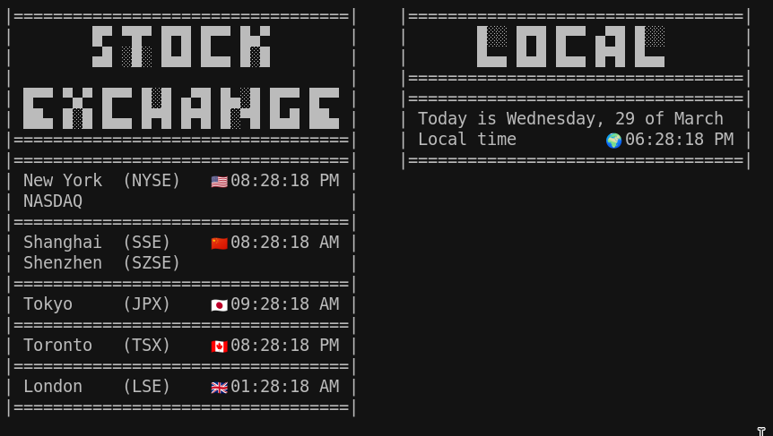

# Global clock



***
## Usage
```bash
clock
```

***

## The End
I hope you enjoy! You can *support* my work [here](https://liberapay.com/Cuatroy2/donate) (I contribute 1% of my revenue to fund carbon removal🌳) or check more content at my [GitHub](https://github.com/alvaro-cas), [YouTube (Spanish)](https://www.youtube.com/@cuatroy2) or [Medium](https://medium.com/@cuatroy2). Happy Day! 😃

<noscript><a href="https://liberapay.com/Cuatroy2/donate"></a></noscript>


