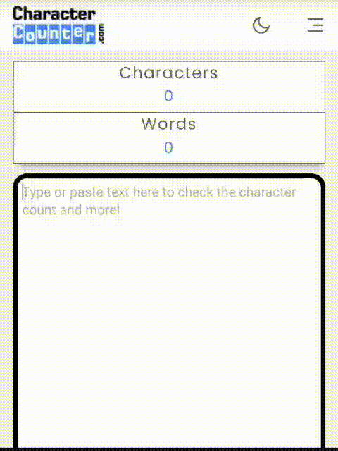

# Medium guide
If you need a how-to guide, refer to my [Medium post](https://medium.com/@alvaro-cas/keepassxc-sending-my-keys-to-my-phone-effortlessly-1eaa4bf23bfe).

# SKEY

## Introduction
Recently I have been using KeepassXC, but sometimes I need to use the passwords in my phone and it is really hard to copy 128 characters, so I created this simple script to avoid passing your .kdbx file to your phone but have the power to send your keys in seconds.



## Prerequisites
#### Developer Options
- [Developer Options](https://developer.android.com/studio/debug/dev-options) enabled and --> USB debugging (I recommend turning this off after usage)

***
## Usage
Copy the desired password normally using KeepassXC or any other password manager. Then use this command to send it to your phone!
```bash
skey
```

***

## Do you find this useful?

Support further development. Buy me a book!

<a href="https://www.buymeacoffee.com/alvaro.cas"></a>

Hey, thank you for your support!


